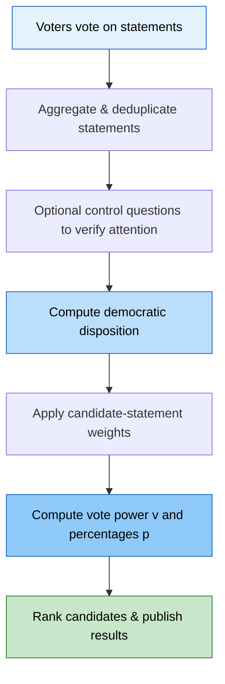
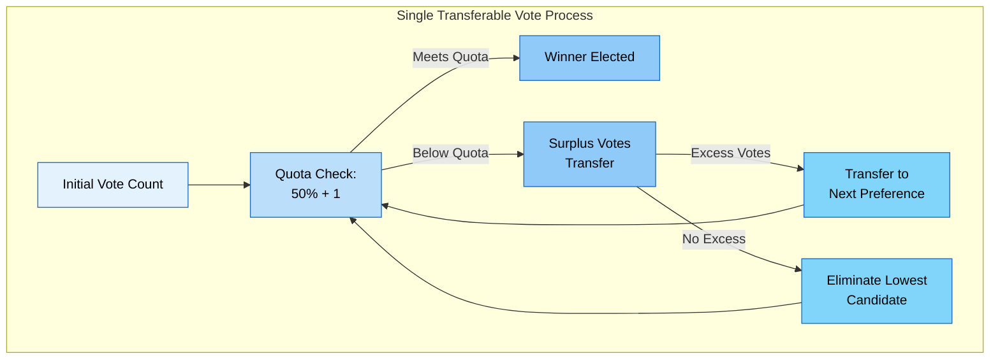

# The Trisophic Union Constitution

Third Constitution "Well what do we name it?"

---

# Notes

This constitution only applies within the Trisophic Union.
We are working with a Trigonocracy Model running at the Municipal level (with exceptions) with Supranational powers outlined in the document.

TEMPORARY MEASURE:
Right, this is to be removed when its no longer required.
Cyborgnetical (The Exectuve), has complete control. He is respondsible to appoint each person to each branch. Once each branch is function, he must give up his absolute power and take role as "The Executive"

# Rights

## UN - Universal Declaration of Human Rights

All text from the Universal Declaration of Human Rights Shall be valid here.
Text:
https://www.un.org/sites/un2.un.org/files/2021/03/udhr.pdf

## Right to Knowledge

Section 1:
Every person has the right to access, preserve, and share human knowledge for educational, research, and civic purposes without economic barrier.

Section 2:
Copyright protections shall not exceed 28 years from first publication.

Section 3:
Libraries, educational institutions, and civic organizations may preserve and provide access to published works for non-commercial educational purposes
without restriction after initial copyright term expires.

Section 4:
No person shall be criminally prosecuted or civilly liable for preserving or sharing knowledge in a format designed for preservation, accessibility, and research, provided no commercial sale or rental occurs.

Section 5:
Congress shall have power to enforce this article by appropriate legislation.

# Rules

1. Political Parties (internal or external) are banned, political identification such as identifying as a Social Democrat or Technocrat are allowed.
2. The following ideologies and any ideologies related to these ideologies are banned: Fascism and Totalitarianism
3. The constitution is the surpreme law of the union.
4. Each branch can come up with their own internal structure, as long as it complies and follows the structure, rules, and powers defined in the constitution.
5. No branch is allowed to extend their own powers to control other branches.

# Definitions

## Subject Election Principal

Elections where voters choose policy statements (subjects) rather than individual candidates; candidates receive support based on how well their proposed statements align with voters' choices.

## Single Transferable Vote (STV)

A form of ranked elections
Each member ranks all candiate from first to last.
Each candiate with or above the panel size divided by the number of seats is automatically elected.
The remaining surplus of votes is reallocated to the rest of the candiates based on each voters next rank preference.
The candiate with the lowest votes will have their votes reallocated to the rest of the candiates based on each voters next rank preference.

If the remaining amount of candiates is equal to the panel size then the remaining candiates are elected to the panel.
If the panel is full then vote reallocation is ended.

## Technocracy

"Rule of the Engineer"
Technocracy is best defined as applying the Scientific Method to solving social problems OR running government as a engineering or technical problem.

### Technocrat

A person who applies technocracy in a governing structure.

## Union

The Trisophic Union

# Branches

## Executive

The executive branch carries out most of the actions within and outside the trisophic union. Follows the rules of the legislative but is free to apply rules in order to fit the best way possible.

The executive is split into multiple offices to distribute power and duties to the most qualified people.

Ideally a from of technocracy would be employed in this branch.

### Offices

The offices is defined in the structure sub-section.

Offices are allowed to define themselves beyond this document but must follow rules outlined here.

Minimum Requirement for all offices:

- Must display a clear argument for why they should be chosen for a spesific office OR chosen for office.
- Must atleast display a clear knowledge and understanding of topics, actioms, and ideas required for each office.
- Must know Trigonocracy.
- Hasn't violated a rule in the past, or has been pardoned.

### Structure

#### Presidential Office

---

There will be two seats in the presidential office

- Executive
- Vice Executive
  Executive and Vice executive have the same amount of power.

TEMPORARY MEASURE: Presidential office is absolute, anything can be done to uphold this constitution.

If any office is empty, then the Presidental office outmatically takes control of that office until its requirements can be met.

##### Membership

- Must be voted in by 2/3rds vote of the Legislative Congress

#### Foreign Affairs Office

---

Handles Diplomacy with alliances. If the Trisophic Union grows to include multiple levels then the tasks of the Foregin Affairs office is delegated to the cooperation office and assumes the new repondsiblity of diplomacy towards different states and higher levels.

##### Membership

- Must be active weekly, higher activity will lead to a higher chance to be chosen.

#### Home Office

---

Respondsible for development and testing of union tools.

This office focuses on intranational affairs, especially on infrastructure and food supply.

##### Membership

- Developer proficent in JS or C/C++ and git

#### Economy Office

---

Respondsible for overview of finiancial situation of the union and finical advise to members.

##### Membership

- Currently have taken or taking finanical classes.

#### Defense Office

---

This office is responsible for the union's defense capabilities and self defense adivce.

##### Membership

- Must be able to bench 135lbs

#### Finance Office

---

This office regulates the executive’s relationship with the monecative, which is the finance-
overseeing state power described in subsection 7.4.

##### Membership

- Part of the Penecium in the Monocative branch or Currently have taken or taking finanical classes along with communications.

#### Judicial Office:

---

This office regulates the executive’s relationship with the jurisdiction.

##### Membership

- Must have atleast contributed to a Trisophic Union document.
- Clear understanding of Trigonocracy
- Understanding of Technocracy

#### Education and Science Office

---

This office oversees the education politics and regulates the relationships with
universities, which, in turn, decide upon the educational basis for the scientific and political elite in the country.

##### Membership

- Must be a teacher or tutor or mentor.

#### Ethical Office

---

To include ethical considerations in the political endeavor, this office represents philosophical
and ethical points of view.

##### Membership

- Membership in this office is to include only philosophers and those with a good moral logic.

#### Food and Health Office

---

This office focuses on healthy nutrition and health care.

##### Membership

- Must be able to bench press 135lbs

#### Work and Social Affairs Office

---

This office focuses on the social aspects in the country, especially employment,
family affairs and youth. Social Sciences in Studium Primum is required.

##### Membership

- Must be social out in public.

#### Environmental Office

This office focuses on the relationship between humanity and its environment, ensuring
that the political endeavor does not neglect nature.

##### Membership

- Only enviormentalists are allowed.

#### Cooperation Office

---

Cooperation office can include people from outside the union we are collaborating with. This is the only office allowed to communicate outside the union.

##### Membership

Membership is split into 2 categories, external and internal.

**Internal**

- Diplomiatic expert, or currently studing communications.

**External**

- Only leaders or representatives from different movements, groups, or organizations are allowed to have external membership.

#### Spacefare Office

---

As an important aspect of the security of survival is to expand into space, this office regulates and oversees spacefare programs and guarantees an efficient and effective collaboration between nations.

##### Membership

- Qualified for both Home and Education Office.
- Clear interest in Astrophysics or Engineering

## Legislative

There wil be three chaimbers within the legislative strucutre
An item can be proposed to the legislative by an member of the union, automatically it should go into one of three classes.

- Minor Congress (Parliment & Council)
  - Small item, requring minimal attention
- Congress (Parliment, Council, & Lobbyists)
  - Default list every item will go to.
- Major Congress (Parliment, Council, Lobbyists, and Pecunium).
  - Deals with budget, or concerns the entire union

Each person with a position in the Legislative is allowed to view each item at any time.

Each person with voting power can approve or reject an item at anytime, their vote can be changed later.

- If an item recives above a 2/3rds or 66% approval, it is passed.
- If an item recives bellow a 33% approval, it is discarded.
- Any item stuck in between or is not given enough votes will have their votes reset
- Any item that is in anylist for more than a month is automatically discarded.
- If an item is changed at any time, the votes are revoked unless it is changed to be a previous state, in that case the votes during that state are restored.

### Structure

#### Parliament

The Parliament will be composed of 8 members at the maximum chosen by election via the Subject Election Principal.
The Parliment is the main Legislative body of the Union, and forms in opposition of the executive.

#### Council

The Council will be composed of 6 members at maximum and chosen by Single Transferable vote

#### The Technocracy Lobby

The Technocracy Lobby may only consist of 4 Technocrats. They have no voting power when it comes elections.

## Judicial

The Judical stays mostly the to the US consitution, with some additions.

### Structure

#### Judicial Board

Processes and judges individuals.

Each Judical Members votes 2/3rds to appoint a new judge.

Each member must choose their own successor if they choose to leave.

Judical Board size limted to 3 people.

#### Judaical Council

Handles more complex cases

#### Custodium

Interprets and enforeces the constitution with logic. Indipendant of any political ideology.

Indipendant of all branches.

##### Duties

Leading the sessions of panels: The custodium leads the sessions to maintain order and to prevent the panels
from behaving too soft towards themselves.
• Protocolization: The custodium records the sessions to maintain the transparency of political processes towards
the people, and thus to enhance the basis for accountability for the incumbents.
• Organization and execution of elections: To prevent electoral fraud, the legislative is not allowed to organize
elections anymore. Accordingly, the other powers face the same limitations. Therefore, the custodium organizes
and executes the elections, counts the votes and declares the results.
• Securing the division of powers: The custodium is responsible for the compliance of incumbents towards the
laws, especially towards the division of political power.
• Detection of corruption and law enforcement: Especially, corruption is to be a focal point of the investigative
actions of the custodium.
• Personal security: Beside control, the custodium also protects the incumbents and the institutions, acting as a union security.

##### Educational Requirements

• Trigonocratic structure and functionality
• Tactics and strategy; military history and theory
• Introduction to intelligence services
• Criminalistics
• Tactical combat

Part of the custodium will consist of Project Algocracy.

## Mediacative

### Rules

Prohibition of war propaganda. In 2001, Anne Morelli systematized the essential war propaganda techniques of Arthur
Ponsonby, who discussed the propaganda approaches to enhance readiness for war (Morelli, 2001; Ponsonby, 1928).
One objective of the mediacative is to prevent, identify, and prosecute these ten techniques of war propaganda:
• “We do not war.”
• “The opposite party alone is guilty for war.”
• “The enemy is inherently evil and resembles the devil.”
• “We defend a noble cause, not our own interests.”
• “The enemy commits atrocities on purpose; our mishaps are involuntary.”
• “The enemy uses forbidden weapons.”
• “We suffer small losses, those of the enemy are enormous.”
• “Recognized artists and intellectuals back our cause.”
• “Our cause is sacred.”
• “All who doubt our propaganda are traitors.”

***Prohibition of emotional coverage of politically relevant subjects.***

Political decision-making must be grounded on logical thinking, facts, and respectful discussion. Emotional mobilization of people contradicts these requirements. There-
fore, reporting must be objective and free of emotional accentuation.

***Requirement of the use of unmistakable, non-suggestive, and neutral wording**.*

In addition to the latter objective, the
information needs to be formulated in clear and neutral speech, without suggestive intrusion of ideas. Thereby, the
public’s opinion can evolve without manipulation.

***Requirement of transparency of coverage***.

For all information delivered, their source and acquisition are to be reported
as well. It is to be guaranteed that their origins are verifiable.

***Requirement of the independent perspective principle.***

To prevent usage of substantive focus and one-sided reporting,
for situations with far-reaching consequences, three perspectives need to be communicated.

***Prohibition of distortion of facts, statistical context distortion, or usage of deepfake media.***

Statistics are often used to convince the public to develop a particular opinion. Albeit the educational system of the trigonocratic system should
minimize the danger of manipulation, the reporting must provide crucial information about the background of statistical
values and the reported content in general.

***Prohibition of proliferation of fake or incomplete news.***

On the one hand, distribution of fake news and context-less
information in social media is to be prohibited. On the other hand, however, media institutions themselves are obligated
only to spread confirmed and context-based information.

***Prohibition of discrimination or discreditation of individuals or groups.***

Often, some people or groups of people are
unofficially declared to be disagreeable. However, the only institution to decide upon someone’s guilt is the jurisdiction.
Before and besides eventual judgements, people are to be treated with respect. Even reports about convicted criminals
must be as neutral as possible. Hereby, scapegoating is to be prevented.

***Prohibition of defamation and undermining of presumption of innocence.***

In addition to the convention before, media is
prohibited to imply that a person (or institution) is to be regarded as guilty, although it is only accused. Until the juris-
diction decides upon the final judgement, the principle in dubio pro reo must be respected. However, if there are justified
doubts about the innocence after the judgement, it can be communicated, but solely on a reasonable basis rather than
defamation-like presumptions.

***Prohibition of capitalization of panic or public emotions.***

It is inevitable that, especially in times of crises, the public is
prone to turmoil and panic. Humans were and are emotional beings, thus emotional debates will take place in future as
well. However, the heating up and capitalization of panic and emotions is to be forbidden, as it constitutes an intervention
into the natural behavior of societies.

***Permission and support of independent, investigative journalism.***

Albeit the institutional power of the media can mobilize large numbers of contingents, proactive investigations have the advantage of flexibility and leads to discoveries of crimes. Therefore, independent investigations are to be permitted and, if necessary, supported and protected

### Structure

#### Mediatorium

Chosen by election via the Subject Election Principal, it can't consist of more than 5 people.

#### Media Delegation

Consists of members that control any portion of media (Union or non-Union controlled)

## Monecative

<!-- Extra note from cyborgnetical--->

<!-- Future plans to intergrate project Cybersyn into this--->

Similarly to the mediacative, the monecative constitutes a novel power of state. It represents the basis for institutions, overseeing the finances of the state, independent from the legislative and executive. However, the trigonocratic principle constitutes a central aspect of its architecture. Therefore, a structure resembling that of the mediacative is to be achieved, including democratic and meritocratic requirements of legitimization.

### Areas of Accountability

In general, all powers and accountabilities of the central banks are to be included in the new power of state. In addition, several competencies of the legislative and the executive are to be subtracted and added to the monecative. This is due to the requirement that the decision-making process concerning financial issues must prevent lavishness among the parliamentarians, who are eager to improve their position against their own stakeholders, i.e. the people.

Therefore, additionally to the supervision of banks, the monecative must be authorized to supervise the financial expenses of the state in general, overseeing the state's budget, i.e. handling of tax income, especially the adequacy of tax law. Furthermore, the monecative is responsible for the prevention and detection of corruption in politics in particular.

Hence, the monecative discusses the financial decision-making with the legislative and the executive. In accordance with the federalistic structure, this overseeing authorization must be adjusted to the corresponding state level.

Further determinations must be made in consideration of the corresponding cultural values and norms, the customary laws and the people's expectations. In each case, the institutional implementation of the monecative is to be called the monetariate. The custodium (see section on Judicial) guarantees the compliance towards the CAT principle.

### Structure

#### Pecunium

The Pecunium constitutes the democratically legitimized chamber of the monetariate. Its primary duties are to represent citizens' financial interests, to set public-facing financial policy goals, and to provide democratic oversight of monetary and fiscal decisions.

Members of the pecunium are called "Pecunians"

##### Election

- Members (pecunians) are elected by voters using the Subject Election Principal (SEP).

##### Membership

- Limited to 5 members only

##### Powers

***Request Review***

- Can request finiance reports from the Aerarium and Union-Controlled financial institutions

***Monetary Policy***

- Can approve, reject, or debate monetary policy proposed by the Aerarium or Executive that affects their respective areas. (Aerarium can only propose policies which only affects the aerarium, Executive can only propose policies that affect the executive)
- Major budgets such as a yearly budget concerning the entire union must still be discussed with the Major Congress.

***Corruption Report***
- Can ignitiate an investigation on Union Politicians if corrution or legal breaches are suspected
- If needed, the custodium can be called at any time to support investigation.
- If a corruption report is done to a member(s) of the penuncum, then only the custodium is allowed to take actions.

##### Rules

1. Anonimous Actions
All actions taken by the penicium are anonmimized to avoid deliberate targeting of an individual for financial or political gain, along with prevetning corruption.
2. Shared Respondsibility
As a counter balence to "Anonimous Actions", all pecunians are respondsible for each others actions, both positive and negative. In essecanse, this means that everyone operates as the same entity to talk to.
3. Complete Neutrality
To become a candidate of the Pecunium, you must have neutral stance towards politics.
(Neutral can be defined, as not benefiting a particular group or individual, but to take in account all views and data and take the smartest action. This means call  - Aerarians are selected according to the SEP among qualified financial professionals, prioritizing candidates with supervisory or central-banking experience.
  - Panel sizes mirror the Pecunium with nAerarium = nPecunium - 1 (or as otherwise set by NLSP rules).
ing out when something is clearly stupid or mean't to benefit a group, even if unintentional. You can still have your own views and affliations but your actiosn must be neutral)
  - The Pecunium shall not perform day-to-day management of banks or execute monetary policy instruments reserved to the aerarium.
  - Decisions requiring technical central-banking operations are made in coordination with the aerarium and documented in public reports.

#### Aerarium

The Aerarium is the technocratic chamber of the monetariate, composed of members (aerarians) with banking, monetary policy, and financial supervision experience. Its role is operational stewardship of monetary instruments, bank supervision, and technical fiscal advice.

##### Elections

- Aerarians are chosen via the Subject Election Principal.
- The "voters" are those institutions or individuals who hold capital (money) and want to participate in the Aerarium
- The "candidates" are proposed by the same capital holders, candidates get to choose what polices they support. 

***Candidate Requirements***
- Must have atleast taken a financial class and have presentable proof OR demonstrate enough knowledge in economics and/or financing.

##### Membership

- Limited to 4 members only

##### Rules
- Must follow laws and orders from both the Pecunium

- Upon completion of project cybernet (Part of Project Cybersyn.) all banks represented by each Aerarium member must register to be part of cybernet. (This rule current is to be defined later)
- Must deliver at the very least a financial report every year.
- Reports must be public, non-sensitive, and clear.
- Where policy choices have distributive or democratic implications, the Aerarium negotiates with the Pecunium; final democratic mandates rest with the Pecunium while technical execution remains with the Aerarium.
# Signatures

# Comments

Anything under the "Comments" section does not apply to the constitution. It is only here to organize thoughs

Pasted a lot from Trigonocracy - Cyborgnetical
Signatures more than likely will be RSA keys - Cyborgnetical
