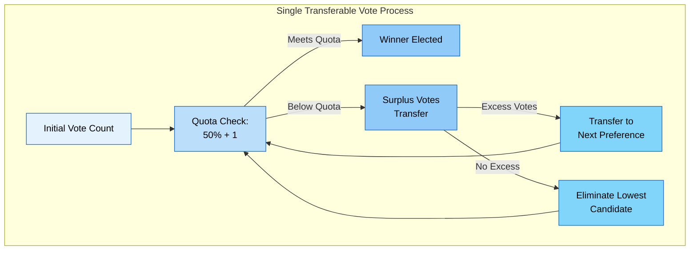

# The Trisophic Union Constitution

 Third Constitution ""
 
 ---

# Notes
This constitution only applies within the Trisophic Union.
We are working with a Trigonocracy Model running at the Municipal level with Supranational powers outlined in the document.
# Rights
# Rules
1.) Political Parties (internal or external) are banned, political identification such as identifying as a Social Democrat or Technocrat are allowed.
2.) The following ideologies and any ideologies related to these ideologies are banned: Fascism and Totalitarianism 

# Definitions 

## Subject Election Principal
"Vote on Subjects not people"
## Single Transferable Vote (STV)
A form of ranked elections
Each member ranks all candiate from first to last.
Each candiate with or above the panel size divided by the number of seats is automatically elected.
The remaining surplus of votes is reallocated to the rest of the candiates based on each voters next rank preference.
The candiate with the lowest votes will have their votes reallocated to the rest of the candiates based on each voters next rank preference.

If the remaining amount of candiates is equal to the panel size then the remaining candiates are elected to the panel.
If the panel is full then vote reallocation is ended.

## Technocracy
"Rule of the Engineer"
Technocracy is best defined as applying the Scientific Method to solving social problems OR running government as a engineering or technical problem. 
### Technocrat
A person who applies technocracy in a governing structure. 

## Union
The Trisophic Union

# Branches

## Executive

### Structure
#### Presidential Office
There will be two seats in the presidential office
- Executive
- Vice Executive
Executive and Vice executive have the same amount of power. 

TEMPORARY MEASURE: Presidential office is absolute, anything can be done to uphold this constitution,
#### Foreign Affairs Office
This office takes care of the foreign diplomacy of the state towards other states, but also
to the upper levels of federalism (supranational and global level). Diplomacy in Studium Primum is required.
#### Home Office
This office focuses on intranational affairs, especially on infrastructure and food supply. Economy
in Studium Primum is required.
#### Economy Office
This office oversees the economic development of the country. Economy in Studium Primum
is required.
#### Defense Office
This office is responsible for the country’s defense capabilities. Military science in Studium
Primum is required.
#### Finance Office
This office regulates the executive’s relationship with the monecative, which is the finance-
overseeing state power described in subsection 7.4. Economy in Studium Primum is required.
#### Judicial Office:
This office regulates the executive’s relationship with the jurisdiction. Law in Studium Primum
is required.

#### Education and Science Office 

Respondsible for development and testing of union tools.

This office oversees the education politics and regulates the relationships with
universities, which, in turn, decide upon the educational basis for the scientific and political elite in the country.
MINT in Studium Primum is required.
#### Ethical Office
To include ethical considerations in the political endeavor, this office represents philosophical
and ethical points of view. Philosophy in Studium Primum is required.
#### Food and Health Office
This office focuses on healthy nutrition and health care. Medicine in Studium Primum
is required.
#### Work and Social Affairs Office
This office focuses on the social aspects in the country, especially employment,
family affairs and youth. Social Sciences in Studium Primum is required.
#### Environmental Office
This office focuses on the relationship between humanity and its environment, ensuring
that the political endeavor does not neglect nature. MINT in Studium Primum is required.
#### Cooperation Office
Cooperation office can include people from outside the union we are collaborating with. This is the only office allowed to communicate outside the union.

#### Spacefare Office
As an important aspect of the security of survival is to expand into space, this office regulates
and oversees spacefare programs and guarantees an efficient and effective collaboration between nations. Physics or mathematics in Studium Primum is required.

## Legislative

There wil be three chaimbers within the union
An item can be proposed to the parliment by an member of the union, automatically it should go into one of three lists. 

- Minor Congress (Parliment & Council)
    - Small item, requring minimal attention
- Congress (Parliment, Council, & Lobbyists)
    - Default list every item will go to.
- Major Congress (Parliment, Council, Lobbyists, and Pecunium).
    - Deals with budget, or concerns the entire union

Each person with a position in the Legislative is allowed to view each item at any time. 

Each person with voting power can approve or reject an item at anytime, their vote can be changed later.
- If an item recives above a 2/3rds or 66% approval, it is passed.
- If an item recives bellow a 33% approval, it is discarded.

- Any item stuck in between or is not given enough votes will have their votes reset
- Any item that is in anylist for more than a month is automatically discarded.
- If an item is changed at any time, the votes are revoked unless it is changed to be a previous state, in that case the votes during that state are restored.

### Structure

#### Parliament
The Parliament will be composed of 8 members at the maximum chosen by election via the Subject Election Principal.
The Parliment is the main Legislative body of the Union, and forms in opposition of the executive.

#### Council
The Council will be composed of 6 members at maximum and chosen by Single Transferable vote

#### The Technocracy Lobby 
The Technocracy Lobby may only consist of 4 Technocrats. They have no voting power when it comes elections.

## Judicial

### Structure

#### Judicial Board
#### Judaical Council
#### Custodium
Part of the custodium will consist of Project Algocracy.

## Mediacative

### Rules

### Structure
#### Mediatorium
Chosen by election via the Subject Election Principal, it can't consist of more than 5 people. 
#### Media Delegation
Consists of members that control any portion of media (Union or non-Union controlled)

## Monocative

### Structure
#### Pecunium
Chosen by election via the Subject Election Principal, it can't consist of more than 5 people.
#### Aerarium
The Aerarium is composed of people who control banks or financial institutions (Union or Non-Union Controlled)

# Signatures

# Comments
Anything under the "Comments" section does not apply to the constitution. It is only here to organize thoughs

Pasted a lot from Trigonocracy - Cyborgnetical
Signatures more than likely will be RSA keys - Cyborgnetical
